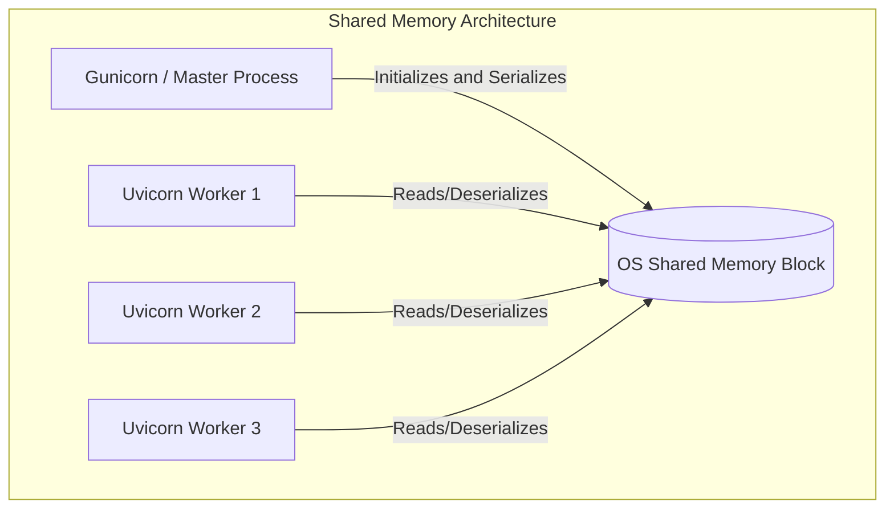

# Backend Development (Zero-DB Mode)

In many modern microservice environments (e.g. reverse-geocoding microservices, address auto-completion APIs, validation endpoints), running a dedicated database server is unnecessary overhead.

**Zero-DB Mode** allows you to load, query, and search the entire administrative regions dataset directly from gzipped CSV files in memory. This guide details best practices for deploying Zero-DB services in production environments using ASGI servers (like FastAPI with Uvicorn/Gunicorn).

---

## 🧠 Shared Memory worker Optimization

When deploying multi-worker python web applications (e.g., Gunicorn running 4 Uvicorn workers), each worker process typically loads the dataset separately. This leads to **memory duplication** (e.g., 4 workers x 250MB = 1GB RAM consumed just by reference data).

To solve this, `py-nusantara` supports a **Shared Memory structure** using Python's native `multiprocessing.shared_memory`. The KD-tree and parsed records are loaded into a single shared memory block, and worker processes attach to it.



### Configuration
```python
config = {
    "shared_memory": {
        "enabled": True,
        "prefix": "nusantara_prod_shm"
    }
}
```

---

## ⚡ Asynchronous Index Initialization

Building spatial KD-tree structures for reverse geocoding is computationally intensive. In a synchronous server startup, building indexes might block the main event loop for several seconds. This can trigger Uvicorn/Gunicorn readiness probe timeouts or crash the pod.

To prevent this, pre-load spatial indexes asynchronously during application startup. This delegates the index builds to a background thread pool:

```python
from py_nusantara import init_spatial_indexes_async

@app.on_event("startup")
async def startup_event():
    # Pre-build indexes asynchronously for provinces and regencies
    await init_spatial_indexes_async(levels=["provinces", "regencies"])
```

---

## 🚀 FastAPI ASGI Boilerplate Example

Below is a production-ready template for a FastAPI administrative lookup microservice utilizing Zero-DB mode with shared memory, Redis pickling cache, and async pre-loading.

```python
import asyncio
from typing import Optional
from fastapi import FastAPI, Query, HTTPException
from pydantic import BaseModel
from py_nusantara import (
    Nusantara,
    init_spatial_indexes_async,
    search,
    find_by_coordinate,
    to_geodataframe
)

# 1. Initialize FastAPI App
app = FastAPI(
    title="Nusantara Administrative API",
    description="Microservice for Indonesia Administrative Regions (Zero-DB)",
    version="1.0.0"
)

# 2. Configure Nusantara Global Facade
CONFIG = {
    "shared_memory": {
        "enabled": True,
        "prefix": "nus_api_shm"
    },
    "cache": {
        "enabled": True,
        "ttl": 86400,
        "prefix": "nus_api_cache",
        "redis_url": "redis://localhost:6379/0",  # Set your Redis URL
        "redis_pickle": True                     # Fast Python object caching
    }
}

# Instantiate global facade
nus = Nusantara(CONFIG)


# 3. Handle Lifecycle Events
@app.on_event("startup")
async def startup_event():
    # Preload heavy KD-Trees asynchronously so they are ready before workers accept traffic
    await init_spatial_indexes_async(levels=["provinces", "regencies", "districts"])


# 4. API Endpoints
class SearchResult(BaseModel):
    id: str
    name: str
    level: str

@app.get("/api/v1/search")
def api_search(
    q: str = Query(..., min_length=2, description="Search query"),
    limit: int = Query(10, ge=1, le=100),
    cursor: Optional[str] = Query(None, description="Cursor for pagination")
):
    """
    Search administrative regions dynamically with autocomplete.
    """
    results = search(q, limit=limit, cursor=cursor)
    
    flat_results = []
    for level, records in results.items():
        for r in records:
            flat_results.append({
                "id": r.id,
                "name": r.name,
                "level": level[:-1] # provinces -> province
            })
            
    return {"results": flat_results}


@app.get("/api/v1/reverse-geocode")
def reverse_geocode(
    lat: float = Query(..., ge=-11.0, le=6.0),
    lon: float = Query(..., ge=95.0, le=141.0)
):
    """
    Resolve coordinates to the administrative hierarchy.
    """
    try:
        address = find_by_coordinate(lat, lon, fallback_to_nearest=True)
        return {
            "province": address["province"].to_dict() if address["province"] else None,
            "regency": address["regency"].to_dict() if address["regency"] else None,
            "district": address["district"].to_dict() if address["district"] else None,
            "village": address["village"].to_dict() if address["village"] else None,
        }
    except Exception as e:
        raise HTTPException(status_code=500, detail=str(e))
```

To run this server with multiple worker processes:
```bash
# Start Gunicorn with Uvicorn workers
uvicorn main:app --workers 4 --host 0.0.0.0 --port 8000
```
When started, `py-nusantara` will allocate a single shared memory segment that all 4 workers attach to.
