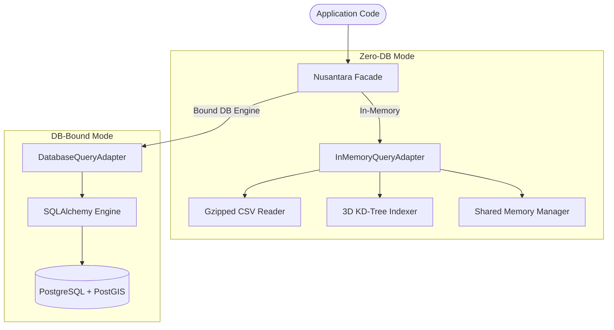

# Getting Started with Python Nusantara

Welcome to **Python Nusantara (`py-nusantara`)**, an enterprise-ready, high-performance library for querying and managing Indonesia's administrative regions database. It compiles and resolves administrative data matching **Kepmendagri No 300.2.2-2138 Year 2025** (Provinces, Regencies, Districts, and Villages).

---

## 📦 Installation

`py-nusantara` is designed with a lightweight core that runs out-of-the-box without external database dependencies. You can install optional groups depending on your stack:

```bash
# 1. Core library only (Zero-DB in-memory operations, CSV-based lookup)
uv add py-nusantara
# or: pip install py-nusantara

# 2. For Pandas DataFrame representation support
uv add py-nusantara --optional pandas

# 3. For SQLAlchemy database integration (seeding, models, and queries)
uv add py-nusantara --optional sqlalchemy

# 4. For distributed Redis caching support
uv add py-nusantara --optional redis

# 5. Install all features
uv add py-nusantara --optional pandas --optional sqlalchemy --optional redis
```

> [!NOTE]
> Advanced spatial features like GeoPandas exports (`to_geodataframe()`) and topological adjacency queries (`find_adjacent()`) require `geopandas` and `shapely` to be installed. They are imported lazily, keeping the core library slim for light deployments.

---

## 🏛️ Architecture Overview

`py-nusantara` provides two fundamental modes of operation to fit into standard software architectures:



### 1. Zero-DB Mode (Default)
Ideal for data science notebooks, serverless environments, or lightweight microservices.
- Parses compressed regional CSV datasets directly into memory.
- Uses an in-memory 3D KD-Tree index for extremely fast coordinates reverse-geocoding, KNN, and radial searches.
- Requires no external database connection.
- Can be optimized for multi-worker backend processes (like Gunicorn/Uvicorn) via **Shared Memory** configurations.

### 2. DB-Bound Mode
Ideal for traditional enterprise monolithic or microservice architectures.
- Triggered by binding a SQLAlchemy engine: `nus.bind(engine)`.
- All regional queries, autocomplete searches, and spatial coordinate operations compile down to native SQL queries.
- Optimizes spatial math by leveraging PostGIS (`ST_Contains`, `ST_DWithin`, `ST_Intersects`, and spatial KNN operators) on the database server.
- Uses PostgreSQL trigram indexes (`pg_trgm`) or `ILIKE` for rapid fuzzy text matching.

---

## ⚙️ Configuration & Schema Customization

You can initialize `Nusantara` with custom configuration structures. This allows you to map the library to existing legacy databases or enforce company-specific schema conventions.

```python
from py_nusantara import Nusantara

custom_config = {
    # 1. Custom table names in your database
    "tables": {
        "provinces": "ref_provinces",
        "regencies": "ref_regencies",
        "districts": "ref_districts",
        "villages": "ref_villages",
    },
    # 2. Custom column configurations and exclusions
    "columns": {
        "provinces": {
            "name": {"name": "nama_provinsi", "enabled": True},   # Renamed column
            "timezone": {"enabled": False},                       # Exclude from queries
            "boundary": {"enabled": True}                         # Enable polygon boundary
        },
        "regencies": {
            "name": {"name": "nama_kabupaten_kota", "enabled": True},
            "latitude": {"name": "lat_y", "enabled": True},
            "longitude": {"name": "lng_x", "enabled": True},
        }
    },
    # 3. Cache settings
    "cache": {
        "enabled": True,
        "ttl": 86400,
        "prefix": "nusantara_ref",
        "redis_url": "redis://localhost:6379/0",
        "redis_pickle": True
    }
}

# Initialize global Nusantara instance with custom config
nus = Nusantara(custom_config)
```

### Dynamic Property Accessors

Even if you rename columns (e.g., `name` $\rightarrow$ `nama_provinsi` or `latitude` $\rightarrow$ `lat_y`), the library maps them dynamically back to the standard record properties:

```python
# Assuming a bound database or parsed record
province = nus.find_province("11")

# Standard accessors always work:
print(province.name)       # Resolves to `nama_provinsi` column behind the scenes
print(province.latitude)   # Resolves to `lat_y` column behind the scenes

# Database ORM properties also allow raw access matching the DB column:
print(province.nama_provinsi) 
```

---

## 💾 Caching System

To avoid repeated CSV parsing or database trips, `py-nusantara` employs a pluggable TTL caching architecture.

### In-Memory Cache
Used by default when `redis_url` is omitted. Stores compiled lookup tables and index nodes in the local process memory.

### Distributed Redis Cache
Configure the cache to use a shared Redis cluster in multi-instance production environments:

```python
config = {
    "cache": {
        "enabled": True,
        "ttl": 3600,
        "prefix": "app_nusantara",
        "redis_url": "redis://localhost:6379/1",
        "redis_pickle": True  # Enable pickling of Python record models for fast deserialization
    }
}
```

> [!TIP]
> Setting `"redis_pickle": True` is recommended for heavy loads. It serializes the entire Record objects (including relations) using `pickle` before sending them to Redis. If set to `False`, only basic JSON shapes are stored.
